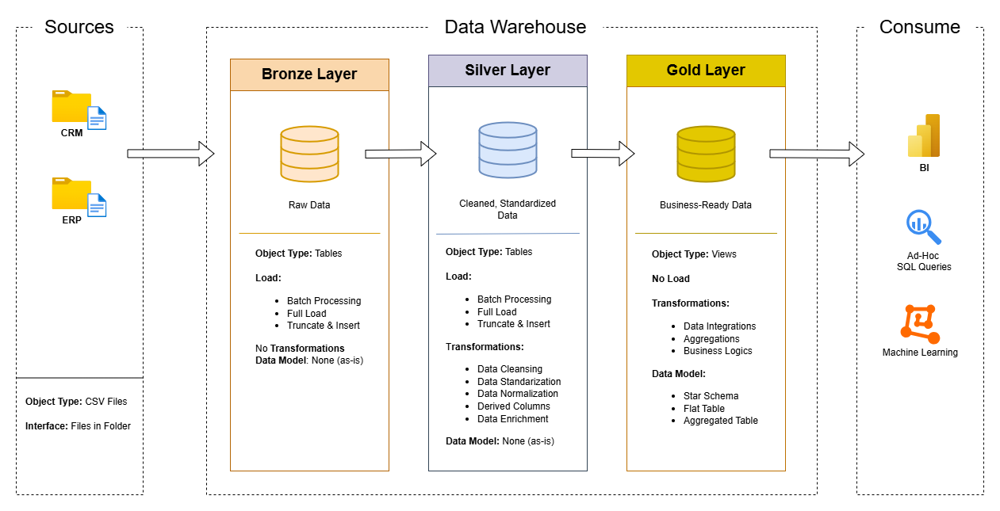
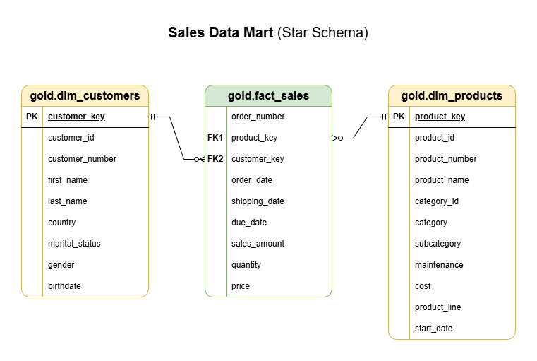
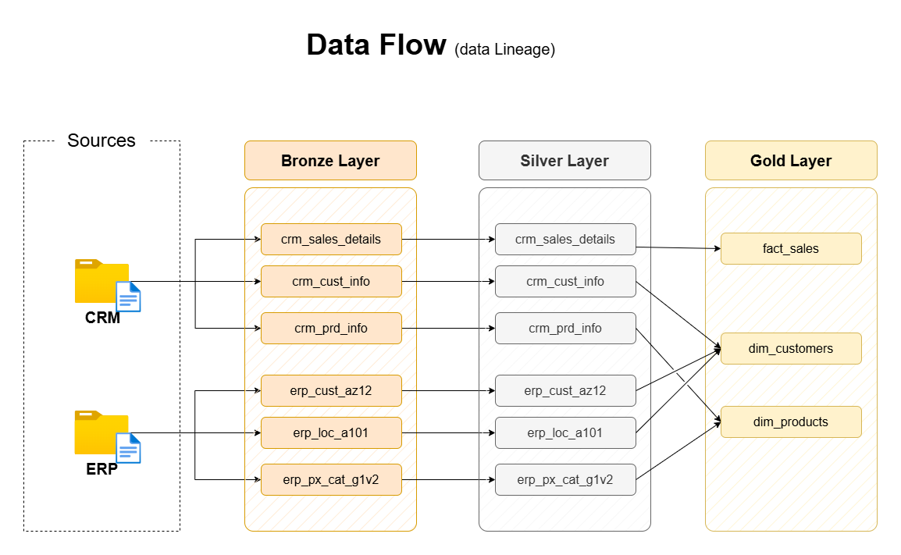

# Data Warehouse and Analytics Project

## 📖 Executive Summary
This project demonstrates an **End-to-End Data Engineering** solution designed to analyze sales performance by integrating data from distinct source systems (ERP and CRM).

The objective was to transform raw, unstructured data into a performant **Data Warehouse** using **Microsoft SQL Server**. The solution follows the **Medallion Architecture** (Bronze, Silver, Gold) to ensure data quality, scalability, and ease of reporting.

---

## 🛠️ Architecture & Methodology
The project is built using a **Multi-Layer Architecture** to decouple raw data ingestion from business logic.



### 1. 🥉 Bronze Layer (Raw Data)
* **Purpose:** Ingest raw CSV datasets from source systems.
* **Action:** Bulk loading data "as-is" to preserve original state.
* **Key Challenge:** Handling inconsistent file formats and preventing data loss during ingestion.

### 2. 🥈 Silver Layer (Cleaned & Conformed)
* **Purpose:** Data cleansing, standardization, and normalization.
* **Transformations:**
    * Standardized date formats and string casing.
    * Handled missing values (NULLs) and duplicates.
    * Integrated data from ERP (Product/Location) and CRM (Customer) systems.
* **Data Quality:** Implemented validation checks to ensure logical consistency (e.g., `Order Date < Ship Date`).

### 3. 🥇 Gold Layer (Dimensional Model)
* **Purpose:** Reporting and analytics optimization.
* **Modeling:** Designed a **Star Schema** with Fact and Dimension tables.
* **Enrichment:**
    * Generated **Surrogate Keys** for referential integrity.
    * Aggregated metrics for fast query performance.

---

## 📊 Data Model & Flow
To ensure data integrity and traceability, I designed a comprehensive data flow and integration model.

### Dimensional Model (Star Schema)
The Gold Layer allows for efficient querying by connecting the centralized Fact table to enriched Dimensions.



### ETL Pipeline Flow
Visual representation of how data moves from CSV extraction to the final analytics layer.



> **Documentation:** For full column details and schema definitions, please refer to the [Data Catalog](docs/data_catalog.md).

---

## 📂 Repository Structure
A transparent view of the project organization:
```text
sql-data-warehouse/
│
├── datasets/               # Raw datasets used for the project (ERP and CRM data)
│
├── docs/                   # Architecture diagrams and Data Catalog
│
├── scripts/                # SQL scripts for ETL and transformations
│   ├── bronze/             # DDL & Loading Stored Procedures for Bronze layer
│   ├── silver/             # DDL & Transformation Logic for Silver layer
│   ├── gold/               # DDL & Views for Gold layer (Star Schema)
│   └── init_database.sql   # Database creation script
│
├── tests/                  # Data Quality validation scripts
│
└── README.md               # Project overview and instructions
```

---

## 🚀 How to Run the Project
To replicate this Data Warehouse locally:

1.  **Clone the Repository:**
    ```bash
    git clone https://github.com/IgorBaranow/sql-data-warehouse.git
    ```

2.  **Set Up the Database:**
    Open **SQL Server Management Studio (SSMS)** and run the `scripts/init_database.sql` script to create the database and schemas.

3.  **Execute the ETL Pipeline:**
    Run the scripts in the following order:

    * **1. Load Bronze Layer (Ingestion):**
        ```sql
        EXEC bronze.load_bronze;
        ```
    * **2. Load Silver Layer (Cleansing):**
        ```sql
        EXEC silver.load_silver;
        ```
    * **3. Generate Gold Layer (Star Schema Views):**
        Execute the `scripts/gold/ddl_gold.sql` script to create the analytical views.

4.  **Verify Data:**
    Run the quality check scripts located in the `tests/` folder to ensure data integrity.

📬 Contact
If you have any questions about the architecture or implementation, feel free to reach out!
